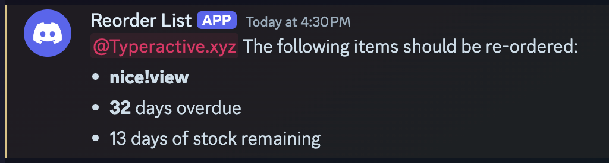
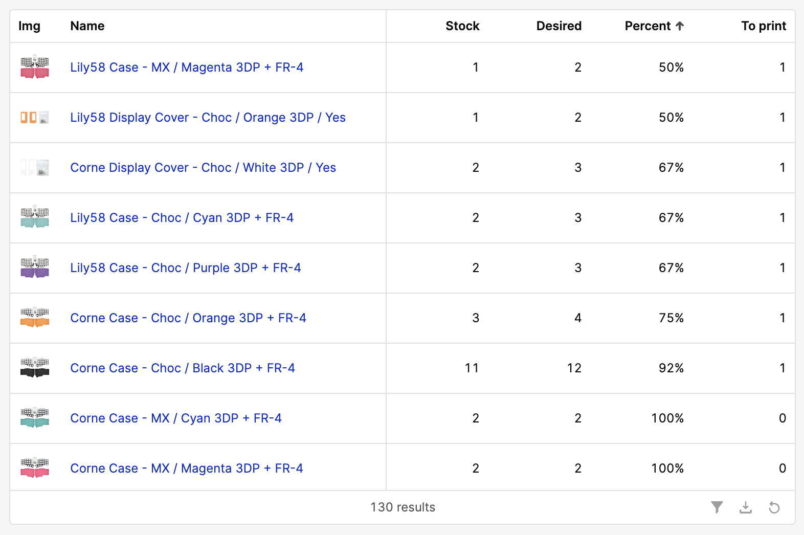
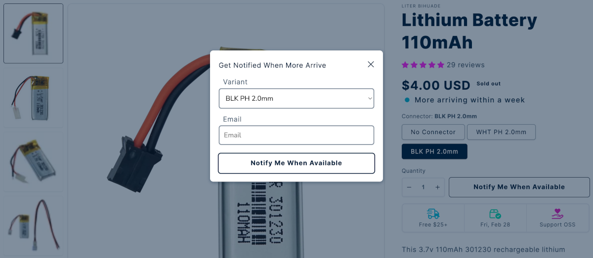
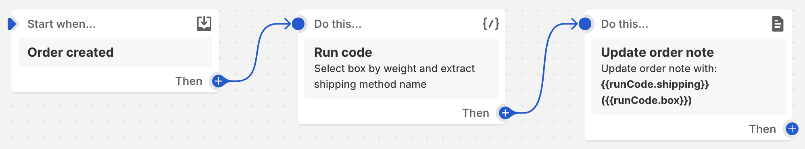
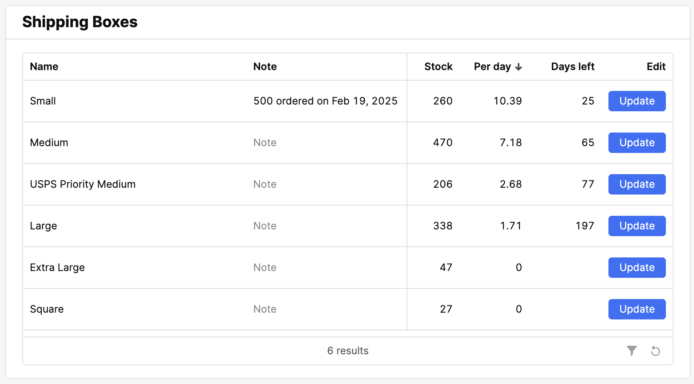

I'm the owner of [Typeractive.xyz](https://typeractive.xyz), a DIY ergonomic keyboard kit store. We currently average 30 orders a day with 10 items per order. This is relatively high volume considering we only have one person full-time working on the store.[^1]

As opposed to other stores in the ergonomic keyboard kit space, we are rarely out of stock of our 250+ product variants, dispatch >99% of eligible orders in one working day, and respond to all customer requests in an average of five hours.[^2]

These achievements are only possible thanks to heavy automation of our daily operations, and after three years of running our store, I'd like to share more details about what small automations have created the biggest impact.

*Disclaimer: Our store runs on Shopify, so lots of the solutions are centered around some tools that are only available with Shopify.*[^3]

## Staying in Stock

After expanding the store to more variants, we grew quickly and immediately ran into a problem every store owner wishes for; how do we keep our products in stock?

### Reorder Notifications

If I had to get rid of every other automation and keep just one, it's this. Every day a Cloudflare Worker calculates how many days left of stock remain based on past sales, creates a list of products that need to be reordered, and posts it to our team's internal Discord. 



Something like this can be implemented in many different ways; here's some more details on ours.

- Different products take different amounts of time to order and receive. We use Shopify [Metafields](https://help.shopify.com/en/manual/custom-data/metafields) to assign a "Days to Reorder" number to every product.
- Quantity sold per day is found using Shopify's "[Days of inventory remaining](https://help.shopify.com/en/manual/reports-and-analytics/shopify-reports/report-types/default-reports/inventory-reports#days-of-inventory-remaining)" report.
- Once ordered, we create a [Purchase Order](https://help.shopify.com/en/manual/products/inventory/purchase-orders) in Shopify, which causes that product to fall of our reorder notification keeping it neat and tidy.
- Neither Shopify's reports nor purchase orders are supported via their API. We access them programmatically by forging a Shopify admin client GraphQL request. You can learn more about forging requests [from my friend David](https://youtu.be/8GZPQUjd7pk?si=krxvkyiKMIDb1R1I). Shopify, *please* add these to your API.

I've considered packaging this up as a simple Shopify App, but I haven't gotten around to it. If this might interest you, let me know!

### 3D Printing Dashboard

Our store also sells some 3D printed products we produce in-house. These products don't have significant lead time, but we can only produce a small amount each day using our three BambuLab printers.

Our existing reorder notification didn't work as well since we should be continually printing and it would cause significant clutter considering we have over 100 3D printed variants. Instead, we have a dashboard showing which variants to prioritize printing.



Once again, we use Metafields to define a per-variant "Desired Stock" value. We know some colors are more popular, so we want to have more ready to go. With this dashboard, instead of blindly scrolling through >100 variants figuring out what to print, we can just find which variants have the lowest desired stock level (percent). This reduces the amount of time it takes to start another print, which requires stepping away from fulfilling orders.

This dashboard in specific is generated using [Retool](https://retool.com/) and Shopify's Admin GraphQL API. Retool works well, but I don't think it's incredible, and there's probably lots of other options out there. It's a shame Shopify's new "[Explorations](https://help.shopify.com/en/manual/reports-and-analytics/shopify-reports/new-analytics/explorations)" in Reports don't appear to support inventory queries like this in any significant capacity.

### Back in Stock Notifications

As a last resort, if we can't keep items in stock, we have back in stock notifications. These are pretty standard. The customer signs up for notifications and receives an email when they're back in stock.

Except I'm a software engineer, so of course I looked at existing solutions and thought, "I can do that better and cheaper". As is usually the case, that was only true if my time wasn't taken into account.



This was all built in a weekend and has cost $0. Here's how it's built.

- A Firebase Firestore stores the requests with a timestamp, product variant ID, and an email.
- When a variant is back in stock, [Shopify Flow](https://help.shopify.com/en/manual/shopify-flow) sends a request to a Firebase functions.
- The function finds all unsent requests in Firestore and batch submits email documents using Firebase's [Trigger Email](https://firebase.google.com/docs/extensions/official/firestore-send-email) extension.
- Those emails are sent using our Google Workspace SMTP server.
- Templates are generated using [MJML](https://github.com/mjmlio/mjml) and stored in Firestore as well. [JSX Email](https://github.com/shellscape/jsx-email) looks like another good option.

If I were rebuilding this today, I'd probably use Cloudflare and Amazon SES. Firebase functions are unbelievably slow to deploy. At the time I built this, Cloudflare Email Workers weren't yet available.

## Dispatching on Time

To dispatch our 30 orders a day on time, we need to save as much of Jack's (our full-time warehouse worker) time as possible.

### Packing Slip Ordering

Our warehouse is laid out with our products along the walls in cubbies, [stackable bins](https://www.menards.com/main/search.html?search=stackable+bins), and drawers. Normally, when a Shopify packing slip is printed out, the order is based on the order that the customer added the items to the cart. This isn't very helpful.

For the final time in this post, I will once again point to Metafields. For every product variant, we set a five digit integer, which orders it in our packing slip. Note that the sorting is alphabetical, so make sure to use all five digits.

After setting up the Metafields we can add a few lines to our packing slip liquid template that will order everything how we want it.

```diff liquid
+
+

+
```

Finally, some code! We first get every unique line item packing order, and then we iterate through each packing order and each line item and only print out when the packing order matches. This is definitely inefficient, but it's fast enough and works well with liquid.

### Packing Slip Notes

When filling an order, it's helpful to know the shipping method and box size. This informs both what box to use (size and whether we use a USPS Priority Mail box) and how things should be packed (international orders may require things like bubble wrap).

To add the shipping method and box size to the order, I use Shopify Flow to update the note.



Whenever an order is created, we bucket the order into a box size by total shipment weight and then extract the shipping method.[^4] Then the order note is set.

### Box Inventory

I'm really surprised that Shopify nor our current shipping platform support box inventories. Keeping track of box inventory is tedious and can cause huge delays in shipping if you forget to order or check on stock levels. We have all the data, yet it's not tracked!

To track this, when we complete a shipment on our shipping platform, a webhook hits a Firebase function endpoint with the shipment payload. Using this payload, we use the box name to log a use of a box and update our inventory in a Firestore.



Once more we create a Retool dashboard that calculates the average box usage per day and tells us the amount of days left. At the end of every day, Jack takes a look at this dashboard and if any is under 30 days, we order more boxes and leave a note.

Maybe at some point we can integrate this with our reorder notifications, but this works for now.

### Multiple Order Flagging

Often times, customers forget an item and end up creating multiple orders in one day. We can save a lot on shipping by combining these orders, but manually going through the orders every day is time consuming.

Amazingly, Shopify has a Flow [template](https://help.shopify.com/en/manual/shopify-flow/concepts/advanced-workflows/examples#when-a-new-order-is-created-check-if-the-same-customer-placed-other-orders-within-the-last-24-hours) exactly for this, and it works *great*! Not much else to say on this besides it's awesome.

## Quality Support, Fast

Admittedly, automating customer support is challenging and can result in a poor customer experience. Because of that, we don't actually automate much of our customer service. Instead, we try to automate everything else as much as possible to give Jack and Mike the time they need to properly handle requests.

We also try to offer our customers as much documentation as possible to prevent unnecessary customer service requests. There's still a few things we do to lighten the burden.

### Discord and an AI Bot

We have an incredible Discord [community](https://typeracitve.xyz/discord). Members help each other, share their builds, and have created a true *community*. When we ship our kits, we include a business card with a link to both our extensive documentation as well as our community Discord.


Once a customer gets to Discord, they can create a post in our help forum. When they do this, they're greeted by an AI bot that has our entire documentation as a system prompt.[^5] While the AI bot does not resolve all submissions, it provides instant acknowledgment and starts the support process.

Mike and Jack monitor the Discord and will help how they can, but often the technical questions aren't in their wheel house. Other community members graciously help out, otherwise the questions will be forwarded to me, and I'll help as soon as I can.

### NotebookLM

This is a recent addition to our toolbox, but NotebookLM acts similarly to our Discord AI bot while being very flexible. We can create new notebooks, drop in documentation, data, customer feedback, etc and then get insights or ask questions about that.

I used this to analyze the results of our recent customer feedback giveaway, and the results were *really* impressive. I read every response myself, but the summary was spot on and I was able to share it with the team.

## Closing Thoughts

It's been fun to be a storefront owner and a software engineer. There's so many opportunities to spend a little time to make things efficient for our exact use case. It's felt like a superpower that's put us ahead of our competition.

This just scratches the surface of the technology that powers our store. There's some other interesting pieces like our the 3D customizer tool (our main differentiator), our shipping integrations, and our B2B vendor order automations. I may write about these in the future, but they don't feel immediately useful to others.

I hope you found this peek into our operations useful or at least interesting! What automations have you found most helpful in *your* business? I'd love to hear about them.

[^1]: I also have a full-time software engineering job, so I only spend a few hours a week on the storefront. Jack is our only full-time, in-person employee. We have a few part-time people working ~5 hours a week for support and item pre-packaging.

[^2]: We actually achieve a P25 response time of just *twelve minutes*. Jack and Mike are incredible.

[^3]: I often see stores spend a lot of time setting up alternative self-hosted storefronts like WooCommerce, Vendure, Medusa, etc. While I'm a huge advocate for self-hosting software (lots of our internal tools are self-hosted), I would highly recommend sticking to Shopify. Your main store expense, by far, will end up being payment processing. Shopify, at least in the US, is extremely competitive on payment processing, and the small monthly fee easily pays for itself in terms of stability, global speed, API and custom app capabilities, Shopify Flow, and more.

[^4]: Thank you Shopify for adding the "Run code" block! This used to be a *massive* if/then/else flow tree.I can see it potentially replacing even more of my Firebase functions and Cloudflare Workers if they continue to expand its capabilities.

[^5]: Google Gemini is slept on. I'm using the Flash 2.0 model, and it's one of the few models that actually seems to take the entire long context into account and doesn't miss instructions. It does all of this while being incredible cost effective.
