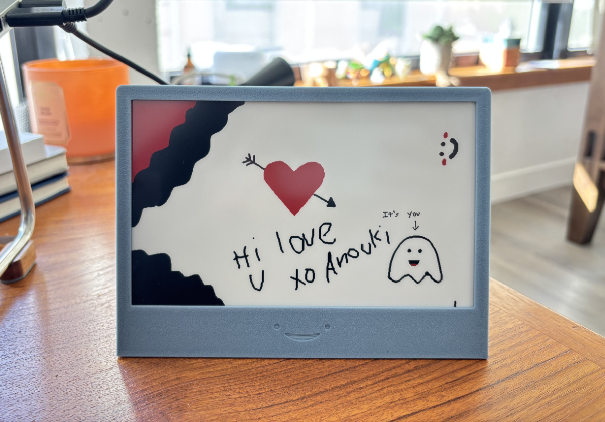
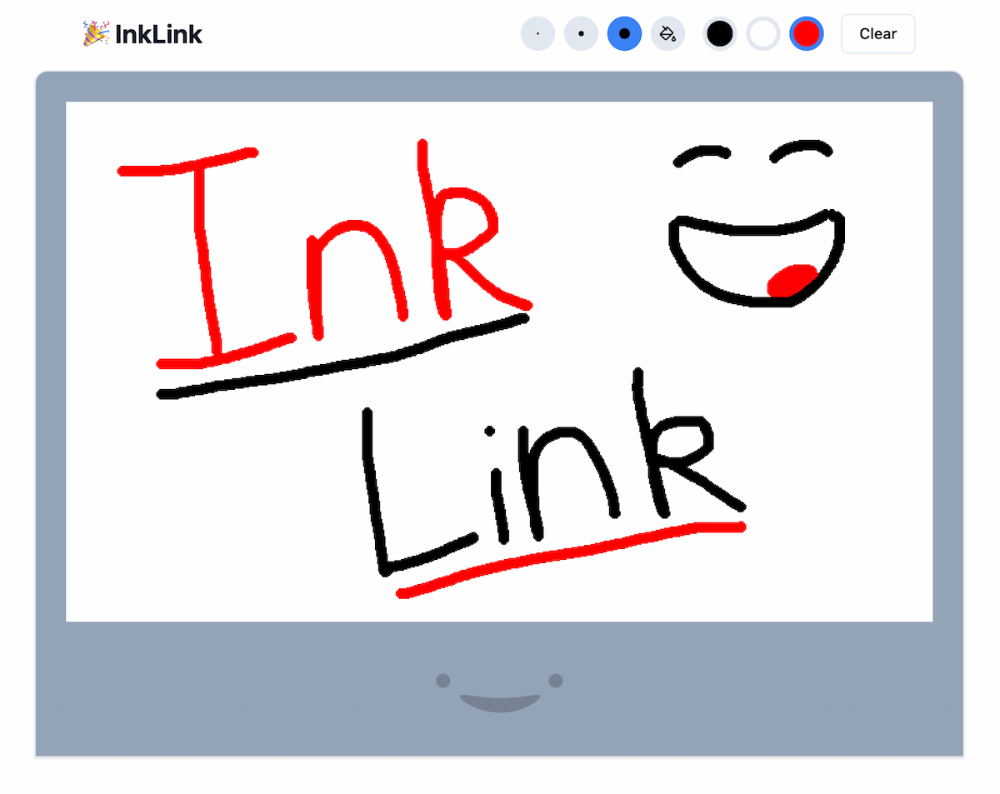

This week, I built a collaborative e-paper display as a gift that I’m calling InkLink.

This fun conversation piece updates every three minutes based on what people have drawn on a web interface.

The web interface supports real-time multi-user canvas drawing. Try it out at [inklink.winans.io](https://inklink.winans.io)! *(This isn't connected to the actual display, feel free to draw whatever you want)*

## How it works

### Hardware

The hardware side of things is pretty simple. The display is a 7.5-inch tri-color e-paper display from Waveshare. It's connected to an ESP32 microcontroller running CircuitPython that fetches the image from a server every three minutes.

### Software

The website is a React app and a Bun server communicating real-time over WebSockets. The Bun server has its own server-side canvas thanks to [@napi-rs/canvas](https://www.npmjs.com/package/@napi-rs/canvas). Each action is applied to the server canvas and then sent to all clients in real-time. The server also exposes a `/drawing.bmp` endpoint that the ESP32 fetches every three minutes.

Side note: This was my first time using Bun, and I’m impressed. Its built-in WebSocket support is fantastic, and the server uses just 10MB of RAM at idle.

## Build your own

This project is simple to make and makes a great gift. It's open source and available on GitHub at [github.com/Nicell/InkLink](https://github.com/Nicell/InkLink) including a full build guide. All the parts are readily available and the total cost is around ~$45-$85 depending on where you source the parts. Feel free to make your own or contribute to the project!
