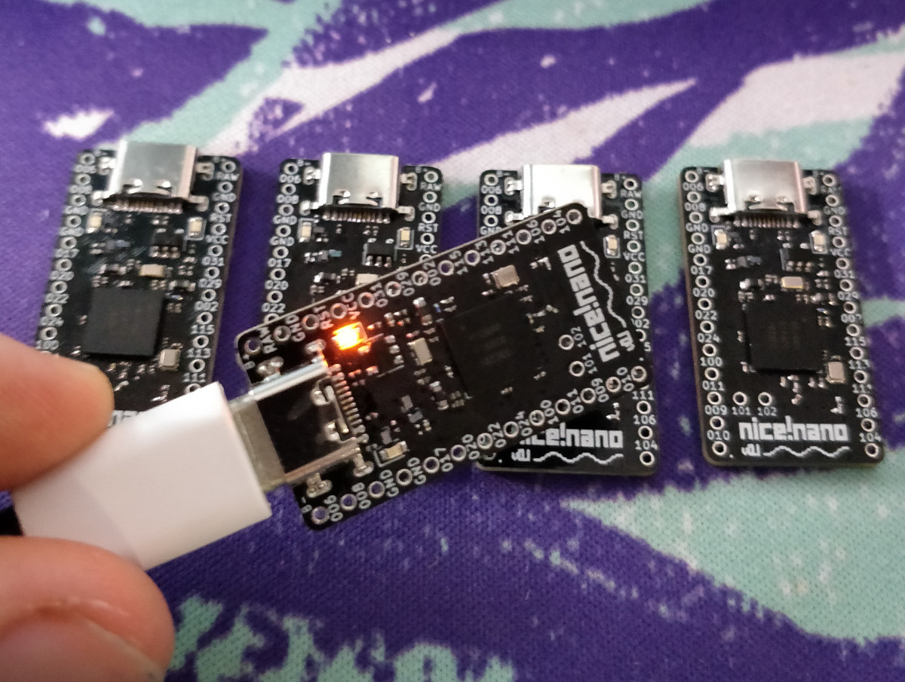
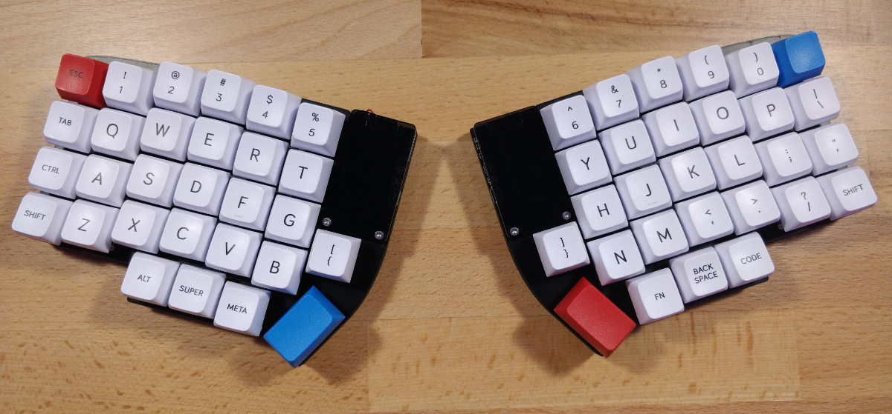
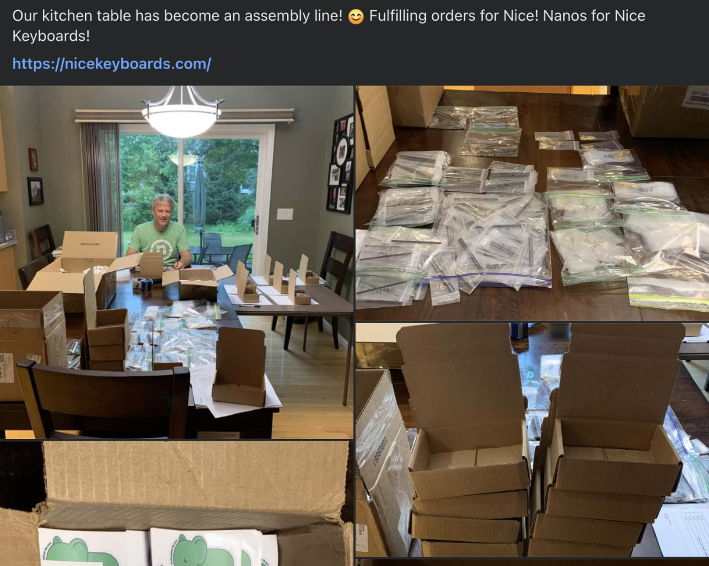

*This post shares the story of the [nice!nano](https://nicekeyboards.com/nice-nano/); a wireless, Pro Micro-compatible microcontroller board I made in my freshman year of college. The nice!nano powers tens of thousands of keyboards, has inspired many, and changed my life.*

Over my first winter break in college, I created what I called the [Dissatisfaction65](https://github.com/Nicell/Dissatisfaction-65), a wireless 65% keyboard inspired by the Satisfaction75. I don't remember exactly why, but I wanted to try making a DIY wireless keyboard after having made a few wired ones. The Adafruit 32u4 Bluefruit LE microcontroller was used to accomplish wireless since the open-source QMK keyboard firmware supported Bluetooth with this specific board. The project looked great in the end, but its performance was *awful*. The typing latency was nearly unusable, and it only lasted a few days on battery even with a huge battery inside.

Seeing all the low-latency, long battery-life wireless products from companies like Logitech and Apple, I knew that something better was possible. In the next two months I dove into the world of wireless microcontrollers and DIY keyboards. I quickly learned that Nordic microchips were the hobbyist's choice and the Pro Micro format reigned as king for DIY keyboards. In my search I discovered three microcontrollers trying to fill the gap between the two: the [BlueMicro](https://github.com/jpconstantineau/NRF52-Board/tree/b739f4d053c72c3307a3888611c3a73fe1c1b757), the [nRFMicro](https://github.com/joric/nrfmicro/tree/cf9c53bb59e2bb070b8206cb768ca13510e35dc8), and the [BLE-Micro-Pro](https://github.com/sekigon-gonnoc/BLE-Micro-Pro/tree/4d61fb50ae3e1cce0928c20ccf690988b3119318).[^1]

| Board         | Retail Cost | Form Factor | Open Source |
| ------------- | ----------- | ----------- | ----------- |
| BlueMicro     | N/A         | Too Large   | Yes         |
| nRFMicro      | N/A         | Yes         | Yes         |
| BLE-Micro-Pro | ~$40        | Yes         | No          |

The BlueMicro's form factor meant that I couldn't build most Pro Micro keyboards since it would interfere. The BLE-Micro-Pro was pretty expensive, locked down, and only sold in Japan. The nRFMicro was pretty close. At first, I decided to modify the nRFMicro to fit my needs, but I soon realized my goals were a bit too ambitious, so I restarted from scratch.

## The nice!nano was born

The weekend (yes, the whole thing was designed in a weekend) I created the nice!nano, I don't think I left my desk for more than sleeping and getting food from the dining hall maybe three times. It was just me, [KiCad](https://www.kicad.org/), Nordic's Infocenter[^2], [nRFMicro wiki](https://github.com/joric/nrfmicro/wiki), and the [Adafruit nRF52840 Feather schematic](https://learn.adafruit.com/introducing-the-adafruit-nrf52840-feather/downloads). I put together the schematic and BOM, laid out the PCB, and routed (and re-routed) the connections. On the other side I came out with the thinnest Pro Micro compatible nRF52840 based board.

Over the next week I created a name and found my PCB assembler. The name is based on my online username, "Nicell". I wanted to continue the spirit of metric naming of the Pro Micro and came up with "nice!nano". The stylized lower-case pixel font mark was created to sit atop the antenna. After reaching out to a few assemblers, the cheapest option for producing five was about $100. That was a lot to spend on what could've easily been a broken design, but after a few days of meticulously re-reviewing my designs, I paid.[^3]

A few weeks later the boards showed up at my door. I was both ecstatic and terrified they wouldn't work. As I plugged in my first one I closed my eyes, tensed up, and peeked. To my surprise and relief, they worked! Over the next couple of weeks I built a Lily58 with them and got a modified version of QMK working on it. In my testing I found the board could last a few weeks on a 110mAh battery. When comparing to the Dissatisfaction65 that lasted a few days on a 2,500mAh battery, we were looking at over a 100x improvement in power efficiency. I was elated, and I posted my fully wireless Lily58 on Reddit and [it got quite a bit of interest](https://www.reddit.com/r/MechanicalKeyboards/comments/fzlfy8/fully_wireless_lily58_pro/).

Over the next few weeks my tiny Discord grew into a sizable community focused on wireless keyboard innovation. I launched an interest check for a group buy, made a few more refinements of the nice!nano, and then I was ready to launch the group buy in mid June.

## Group buys are awful

As a college student, I didn't have the money to bank roll a purchase of 1,000 nice!nanos, so I ran a group buy pre-purchase. At the time I had set a minimum purchase amount of 200 pieces for the order to go through and a maximum of 1,000 because I didn't think I could handle more than that. I set the end date for a month later. In the end, it wasn't even open for a day.

The sale went live on June 20th at 11am central. Within the first few minutes I had met my minimum purchase amount. I remember sitting in my childhood bedroom (thanks covid) on the Shopify dashboard watching orders pour in. It was an incredible feeling. Within just seven hours all 1,000 nice!nanos had been sold, ending the group buy. In the next two months I got all the product in and shipped out the 400+ unique orders with the help of my family.

*My mom posted about the fulfillment process on Facebook. It was a family effort!*

With the success of the group buy, you might wonder, what's so awful? Well, it was extremely stressful holding on to so many people's money without a physical product to back it yet. Along with PayPal holding half the funds of the group buy for a while, it was a bit terrifying. At the same time, group buys have caused the mechanical keyboard community a lot of strife with stolen funds and extremely delayed projects. When I see well-established stores that *should* have capital running group buys, I can't help but shake my head. I decided shortly after this that I will never run a group buy again.

## ZMK

Rewinding back a couple of months, as I was waiting for group buy product to come in, there was still a fairly major part of the ecosystem missing; decent firmware. I bounced between different existing options unsatisfied with the result. That was until I was connected with Pete Johanson who coincidentally had started working on a wireless keyboard firmware powered by the modern Zephyr RTOS.

I quickly sent some pre-production units to Pete to mess around with. Shortly after, he got an early version of ZMK working on the nice!nano, and we hit the ground running building a new wireless-first firmware with a low-power focus. By early 2021 a small community led by Pete had created an extremely performant and feature-full wireless firmware.

## Settling in

In 2021 I really settled in to my new small business. My vendor network was growing around the world, nice!nanos were flying off the shelves and hard to keep in stock, and the ZMK community continued to grow and strengthen. Other popular ZMK boards started to pop up around here with lots of them inspired by the nice!nano, or they were at least using my schematic, which I released publicly.

Everything was looking great, but I noticed that most of my vendors did not carry all the parts needed for a wireless build, or that their builds focused on wired microcontrollers. I figured I could bring something new to this area.

## Becoming the vendor

As a full time student, I knew I couldn't run a whole ecommerce store easily by myself. Luckily, my parents decided to retire at the end of 2021, and my dad was saying he needed something to keep himself busy. Together in 2022 we started [Typeractive](https://typeractive.xyz), a keyboard store focused on the wireless keyboard experience.

I created a [3D interactive configuration tool](https://typeractive.xyz/pages/build) for people to get all the parts they needed and kits specially designed for wireless boards. This low friction experience was a huge success, and now in 2025 we're one of the largest split keyboard stores. There's a lot more that happened with Typeractive, but I can tell that story another time.

## Cloned, twice!

In 2023 the nice!nano was cloned not once but twice. Two different designed copies popped up on Taobao, and it wasn't long before they ended up on AliExpress and even on my existing vendors' stores. I was a bit shocked by this, and in the end I found I couldn't do much about this.

To be clear, these are _clones_. I think competition is fair, but both of these new boards that popped up are advertised as nice!nanos and are shipped with the exact same firmware I use on the nice!nano, so when someone plugs it in, it says it's a nice!nano. If the manufacturers would have just built their own firmware (it's open source!) and not used the nice!nano in the title of their listings, I would say it's fair game.

Seeing my product get cloned gave me mixed feelings. As everyone knows, imitation is the greatest form of flattery, but seeing them ride the coattails of my work was frustrating. At the end of the day though, their product is subpar, and nice!nanos continue to sell at a consistent rate. Some of that is likely due to the largest DIY wireless keyboard store not stocking them. Thanks, Typeractive!

## The million dollar product

Ok, so the title is a bit of click-bait, but if you made it this far, I suppose it worked. To date, over 50,000 nice!nanos have been sold at various online retailers around the world representing over a million dollars in sales. It's hard to wrap my head around still, and I'm extremely grateful. While I put in a lot of hard work, I also recognize that timing and luck played a significant role. The growing interest in wireless keyboards and the lack of available options in the DIY space created the perfect environment for the nice!nano to thrive.

Creating this post has been an incredible trip down memory lane. The nice!nano has had immeasurable impact on my life, and it only happened thanks to so many people that helped along the way. In semi-chronological order, I'd like to shout out individuals that helped me immensely:

- Joric (creator of the nRFMicro)
- Pierre Constantineau (creator of the BlueMicro board an firmware)
- Pete Johanson (creator of ZMK)
- Mike and Pam (my parents)

Thank you. It's been incredibly rewarding to see all the custom keyboards built with or derived from the nice!nano. The community is still growing, and I'm glad that the nice!nano gets to be a big part of it.

[^1]: I've purposefully left links to each repository in the state I would have been reading them back in early 2020.

[^2]: As I wrote this, I found out that Nordic's Infocenter was shut down, RIP.

[^3]: I sometimes laugh at how scary that $100 purchase was for me at the time. All things considered, this is an extremely cheap R&D investment.
